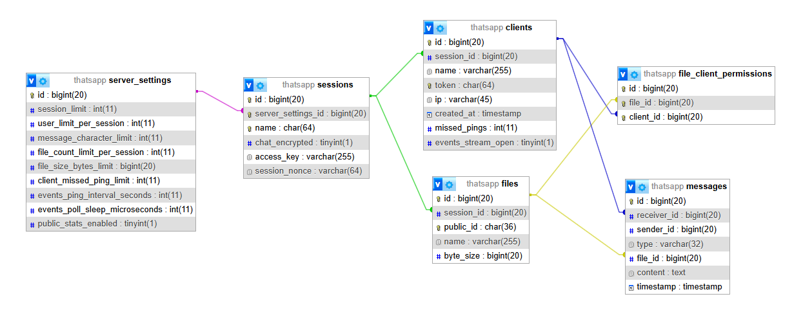
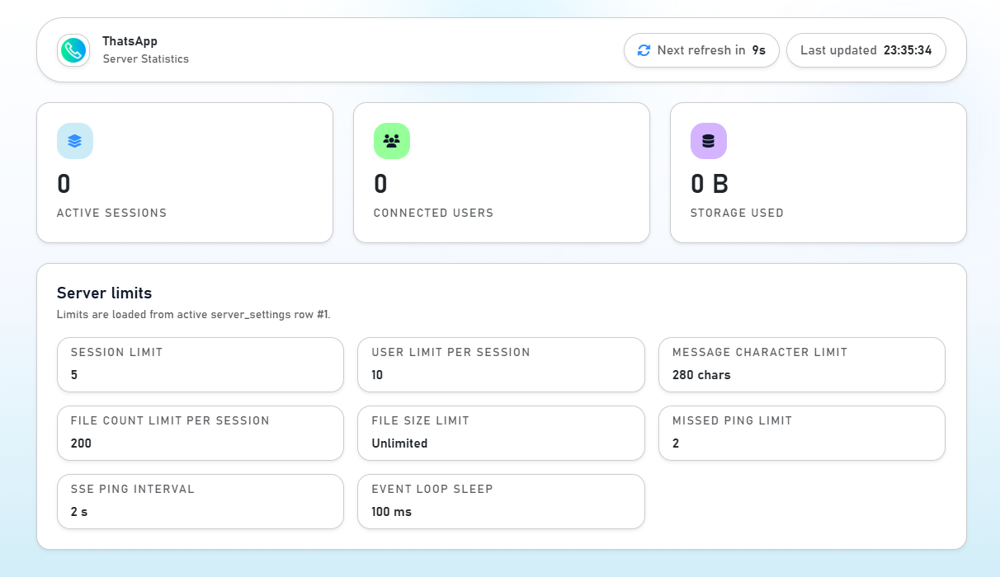

# ThatsApp Webserver

<p align="center">
  
</p>

This directory contains the **CodeIgniter 4 backend** used by ThatsApp in `Webserver` mode. It is responsible for session lifecycle, authenticated client admission, real-time event delivery, file uploads/downloads, persistent limits, and the public statistics page.

If you want the overall project overview first, read the root [README.md](../README.md).

<details>
<summary><strong>Stack</strong></summary>


- PHP 8.5
- CodeIgniter 4.7
- `ankitpokhrel/tus-php` 2.4 for resumable uploads
- Bootstrap 5.3 for the public stats dashboard
- jQuery 3.7 for the public stats dashboard refresh logic
- Composer 2.9 for dependency management
- PHPUnit 13.1 for backend tests
- MySQL/MariaDB-style database access through CodeIgniter's `MySQLi` driver by default


</details>

---

<details>
<summary><strong>Responsibilities</strong></summary>


- Create or reopen chat sessions after a handshake
- Admit clients with per-session user limits
- Store messages and typing events in the database
- Stream pending events over Server-Sent Events
- Accept resumable uploads via TUS
- Grant authenticated one-time file downloads
- Remove dead clients and clean up orphaned files/sessions
- Expose a public live stats dashboard when enabled


</details>

---

<details>
<summary><strong>Local Setup</strong></summary>


### 1. Install dependencies

```bash
cd Webserver
composer install
```

### 2. Configure environment

Create a real `.env` from the provided `env` template and set at least:

- `CI_ENVIRONMENT`
- `app.baseURL`
- `app.forceGlobalSecureRequests = true`
- `database.default.hostname`
- `database.default.database`
- `database.default.username`
- `database.default.password`
- `database.default.DBDriver`
- `database.default.port`

The default config expects a MySQL-compatible database through `MySQLi`.

Optional:

- `thatsapp.serverId`
  Selects the active row from `server_settings`. Defaults to `1`.

### 3. Import the schema

Import [app/Database/database.sql](app/Database/database.sql) into your database.

This project uses the SQL file as the authoritative schema. It does not ship dedicated migrations for the ThatsApp tables.

### 4. Serve the application

Deploy the project so the CodeIgniter front controller is reachable at:

```text
<deployment-base>/public/index.php
```

The desktop client appends `/public/index.php` to the deployment base URL you enter.

If you use `php spark serve` for quick local checks, keep the same client URL rule in mind.

### Apache request-size guard

When the backend is served through Apache with `mod_rewrite` and `.htaccess` support enabled, [public/.htaccess](public/.htaccess) rejects oversized `POST` requests with `413 Payload Too Large` before `public/index.php` and CodeIgniter run.

The shipped rule applies a `16 KB` cap to these small JSON endpoints:

- `/api/sessions/{session}/handshake`
- `/api/sessions/{session}/connect`
- `/api/sessions/{session}/disconnect`
- `/api/sessions/{session}/heartbeat`
- `/api/sessions/{session}/messages`
- `/api/sessions/{session}/typing`

The TUS upload endpoints under `/api/sessions/{session}/uploads` are intentionally excluded because they legitimately send large request bodies.

If you deploy behind nginx, Caddy, a reverse proxy, or Apache without `.htaccess` overrides, configure an equivalent request-body limit there as well.

### 5. Connect from the desktop client

In the Java client:

1. choose `Webserver` as the connection type,
2. enter the deployment base URL described above,
3. set session name, `access key`, and optional `room secret`,
4. decide whether the session may be auto-created.

When auto-create is enabled, these values define the new session: the `access key` controls admission when set, while the optional `room secret` enables client-side encryption and is not sent to the backend.


</details>

---

<details>
<summary><strong>Tests</strong></summary>


Run the backend tests:

```bash
cd Webserver
composer test
```

Generate coverage:

```bash
cd Webserver
composer test:coverage
```

The shipped tests cover:

- session-name and token validation
- strict type validation helpers
- handshake/session helper logic
- message payload validation
- filesystem and TUS storage helpers
- basic application health


</details>

---

<details>
<summary><strong>Transport Model</strong></summary>


The `Webserver` mode is not a separate web UI chat client. It is a **backend transport** for the Java desktop client.

The flow is:

1. The desktop client derives the web session name and hashes it when a `room secret` is active.
2. It calls `POST /api/sessions/{session}/handshake`.
3. It calls `POST /api/sessions/{session}/connect` and receives a token.
4. It opens `GET /api/sessions/{session}/events` as an SSE stream.
5. It sends messages, typing updates, heartbeats, disconnects, uploads, and downloads through the remaining API endpoints.

### Session creation parameters

When `autoCreate` is enabled and the session does not yet exist, the first client creates it through the `handshake` request. The backend stores the provided `access key` as a password hash, stores the generated session nonce, and records whether the session expects encrypted chat payloads.

The `room secret` is client-side only. When it is set, the client hashes the configured session name with it before the first request. The backend sees and stores that hash as the session name, not the original room label.

After the backend returns the session nonce, the client uses the `room secret` and nonce to derive the AES-GCM key for encrypted names, messages, typing payloads, file names, and file content.

### Important URL note

The Java client normalizes the configured server URL to:

```text
<base>/public/index.php
```

That means the value entered in the client should be the deployment base path before `public/index.php`.

Example:

```text
Configured in client: https://example.com/ThatsAppApi
Resolved by client:   https://example.com/ThatsAppApi/public/index.php
```

Deploy the application accordingly.


</details>

---

<details>
<summary><strong>API Reference</strong></summary>


### Common headers

- `X-ThatsApp-Token`: required for authenticated requests after `connect`
- `Last-Event-ID`: optional on the SSE endpoint to resume after the last processed event
- `X-Last-Event-ID`: optional on `heartbeat` and `disconnect` so the backend can delete already-processed messages

### Endpoints

<table>
  <tr><th>Method</th><th>Route</th><th>Purpose</th><th>Auth</th><th>Response shape</th></tr>
  <tr><td><b>POST</b></td><td><code>/api/sessions/{session}/handshake</code></td><td>Validate <code>access key</code>, optionally auto-create the session, verify encryption mode, and return the session nonce.</td><td>No token yet</td><td>Plain text <code>key=value</code> lines</td></tr>
  <tr><td><b>POST</b></td><td><code>/api/sessions/{session}/connect</code></td><td>Create the client row, broadcast a <code>USER_JOIN</code> event, and return token, client ID, users, and limits.</td><td>No token yet</td><td>Plain text <code>key=value</code> lines</td></tr>
  <tr><td><b>GET</b></td><td><code>/api/sessions/{session}/events</code></td><td>Open the long-lived SSE stream for pending messages and file events.</td><td><code>X-ThatsApp-Token</code></td><td><code>text/event-stream</code></td></tr>
  <tr><td><b>POST</b></td><td><code>/api/sessions/{session}/messages</code></td><td>Store a chat message for every other client in the session.</td><td><code>X-ThatsApp-Token</code></td><td>JSON</td></tr>
  <tr><td><b>POST</b></td><td><code>/api/sessions/{session}/typing</code></td><td>Store a typing payload for every other client in the session.</td><td><code>X-ThatsApp-Token</code></td><td>JSON</td></tr>
  <tr><td><b>POST</b></td><td><code>/api/sessions/{session}/heartbeat</code></td><td>Reset missed-ping count and acknowledge processed events.</td><td><code>X-ThatsApp-Token</code></td><td>JSON</td></tr>
  <tr><td><b>POST</b></td><td><code>/api/sessions/{session}/disconnect</code></td><td>Disconnect the client, clean its uploads, emit <code>USER_LEAVE</code>, and maybe delete the session.</td><td><code>X-ThatsApp-Token</code></td><td>JSON</td></tr>
  <tr><td><b>GET</b></td><td><code>/api/sessions/{session}/files/{publicId}</code></td><td>Download a stored file if the client still has permission for it.</td><td><code>X-ThatsApp-Token</code></td><td>File download</td></tr>
  <tr><td><b>POST</b>, <b>OPTIONS</b></td><td><code>/api/sessions/{session}/uploads</code></td><td>Create a TUS upload slot.</td><td><code>X-ThatsApp-Token</code></td><td>TUS protocol response</td></tr>
  <tr><td><b>HEAD</b>, <b>PATCH</b>, <b>OPTIONS</b></td><td><code>/api/sessions/{session}/uploads/{uploadKey}</code></td><td>Continue, inspect, or finish a TUS upload.</td><td><code>X-ThatsApp-Token</code></td><td>TUS protocol response</td></tr>
</table>

### Request payloads

- `handshake`

```json
{
  "accessKey": "optional-or-required-access-key",
  "autoCreate": true,
  "chatEncrypted": true
}
```

- `connect`

```json
{
  "accessKey": "optional-or-required-access-key",
  "name": "encrypted-or-plain-user-name",
  "chatEncrypted": true
}
```

- `messages`

```json
{
  "message": "P2:plain-text-or-E2:encrypted-payload"
}
```

- `typing`

```json
{
  "payload": "encrypted-ttl-or-stop-payload"
}
```

### Event types sent over SSE

<table>
  <tr><th>Type</th><th>Meaning</th></tr>
  <tr><td><code>MESSAGE</code></td><td>Normal chat message.</td></tr>
  <tr><td><code>USER_JOIN</code></td><td>A new client joined the session.</td></tr>
  <tr><td><code>USER_LEAVE</code></td><td>A client left or was cleaned up.</td></tr>
  <tr><td><code>USER_TYPING</code></td><td>Typing-state update for another client.</td></tr>
  <tr><td><code>FILE_META</code></td><td>A file became available for download.</td></tr>
</table>

Each SSE event uses the database message ID as its event ID. The client stores the highest processed ID and can resume from there after a reconnect.


</details>

---

<details>
<summary><strong>Message, Session, And File Lifecycle</strong></summary>


### Handshake and connect

- `Sessions::handshake()` validates the session name and body, checks the `access key`, verifies the expected encryption mode, optionally creates the session, and returns the session nonce.
- `Sessions::connect()` admits the client only if the session exists, the `access key` matches, the encryption mode matches, and the per-session user limit is not exceeded.
- Non-empty `access key` values are stored with `password_hash()` and verified with `password_verify()`.

### Live events

- Every message is stored once per recipient in the `messages` table.
- `Events::events()` polls pending rows and streams them as SSE events.
- The backend periodically sends `: ping` comments and increments `missed_pings`.
- If a client misses too many heartbeats, the backend finalizes the disconnect and cleans up its state.

### File uploads

- Upload creation is validated through `FilesModel::uploadContext()`.
- Uploads first land in the TUS temp area under `writable/uploads/tus`.
- On `UploadComplete`, `FilesModel::finalizeTusUpload()`:
  - creates a file row,
  - moves the completed upload into a permanent session/file directory,
  - creates `file_client_permissions` rows for every recipient,
  - enqueues a `FILE_META` event for each recipient.

### File downloads

- `Files::file()` only serves a file if the requesting client still owns a matching permission row.
- After a successful download, the permission is deleted.
- When the last permission disappears, the backend schedules deletion of the physical file and removes the database row.

### Disconnect and cleanup

- `SessionLifecycleTrait::finalizeDisconnect()` removes the client, cleans up its unfinished TUS uploads, emits `USER_LEAVE` for the remaining recipients, and deletes the session entirely if it becomes empty.
- Orphaned file directories are removed when no permission rows remain.
- Disconnect logic is used for explicit disconnects and unresponsive-client cleanup.


</details>

---

<details>
<summary><strong>Database Schema</strong></summary>


The canonical schema lives in [app/Database/database.sql](app/Database/database.sql). The backend reads its limits and feature flags from the active `server_settings` row, selected by the optional `thatsapp.serverId` environment value.

<p align="center">
  
</p>

### Tables

<table>
  <tr><th>Table</th><th>Purpose</th></tr>
  <tr><td><code>server_settings</code></td><td>Selectable limit and feature profiles for the backend.</td></tr>
  <tr><td><code>sessions</code></td><td>Named chat rooms bound to one row in <code>server_settings</code>, including <code>access key</code> hash, session nonce, and encryption mode.</td></tr>
  <tr><td><code>clients</code></td><td>Connected client records with token, display name, IP, and missed-ping counter.</td></tr>
  <tr><td><code>messages</code></td><td>Per-recipient event queue for chat, typing, join/leave, and file metadata.</td></tr>
  <tr><td><code>files</code></td><td>Stored uploaded files belonging to a session.</td></tr>
  <tr><td><code>file_client_permissions</code></td><td>One-time download permissions per file and recipient.</td></tr>
</table>

### Default server settings row values

The shipped `database.sql` inserts `server_settings.id = 1` with these defaults:

- `user_limit_per_session = 10`
- `session_limit = 5`
- `file_size_bytes_limit = 104857600` (100 MiB; `0` means unlimited)
- `file_count_limit_per_session = 100` (`0` means unlimited, `-1` disables file transfer)
- `message_character_limit = 500` (`0` means unlimited)
- `client_missed_ping_limit = 2`
- `events_ping_interval_seconds = 2`
- `events_poll_sleep_microseconds = 100000`
- `public_stats_enabled = 1`

These values directly affect the Java client behavior because the `connect` response returns the active message limit, file size limit, and whether file transfer is enabled for the session.

To use a different settings profile:

```ini
thatsapp.serverId = 2
```


</details>

---

<details>
<summary><strong>Storage Layout</strong></summary>


- TUS temp cache: `writable/cache`
- TUS temp upload files: `writable/uploads/tus`
- Finalized downloadable files: `writable/uploads/{sessionId}/{fileId}/{fileName}`
- Logs: `writable/logs`

The helper classes involved are:

- `App\Support\TusStorage`
- `App\Support\Filesystem`
- `App\Controllers\Api\SessionLifecycleTrait`


</details>

---

<details>
<summary><strong>Public Statistics Page</strong></summary>


The backend exposes these routes relative to the deployment base URL:

- `/`: stats page
- `/stats/data`: stats data endpoint

The stats page reports:

- active sessions
- connected users
- currently stored file bytes
- all configured server-side limits

<p align="center">
  
</p>

The page refreshes automatically every 10 seconds. Setting `public_stats_enabled = 0` in the active `server_settings` row hides the page and makes `/stats/data` unavailable as well.


</details>

---

<details>
<summary><strong>Validation And Error Handling</strong></summary>


- Session names are trimmed, may not contain `/`, and are limited to 64 characters.
- JSON bodies are validated through CodeIgniter validation rules in `app/Config/Validation.php`.
- Errors are returned consistently as JSON objects with an `error` field and the appropriate HTTP status.
- The backend distinguishes invalid token, session not found, `access key` mismatch, encryption mode mismatch, file limit reached, file too large, and several upload/storage failures.


</details>

---

<details>
<summary><strong>Directory Structure</strong></summary>


<table>
  <tr><th>Area</th><th>Path(s)</th><th>Description</th></tr>
  <tr><td><b>Routing</b></td><td><code>app/Config/Routes.php</code></td><td>Registers the stats page and all API routes under <code>/api</code>.</td></tr>
  <tr><td><b>API controllers</b></td><td><code>app/Controllers/Api/</code></td><td>Session lifecycle, messages, typing, event streaming, downloads, and TUS upload endpoints.</td></tr>
  <tr><td><b>API models</b></td><td><code>app/Models/Api/</code></td><td>Database logic for sessions, clients, messages, files, permissions, and event queues.</td></tr>
  <tr><td><b>Stats page</b></td><td><code>app/Controllers/Stats.php</code>, <code>app/Views/stats.php</code>, <code>public/style.css</code></td><td>Public dashboard that reports current sessions, users, stored file bytes, and configured limits.</td></tr>
  <tr><td><b>Support helpers</b></td><td><code>app/Support/</code></td><td>Error strings, directory cleanup helpers, and TUS storage path helpers.</td></tr>
  <tr><td><b>Validation</b></td><td><code>app/Config/Validation.php</code>, <code>app/Validation/StrictTypes.php</code></td><td>Strict JSON/body validation for handshake, connect, token, message, and typing payloads.</td></tr>
  <tr><td><b>Schema</b></td><td><code>app/Database/database.sql</code>, <code>../img/database.png</code></td><td>Canonical SQL schema plus a visual schema image.</td></tr>
  <tr><td><b>Writable data</b></td><td><code>writable/</code></td><td>Logs, cache, sessions, debugbar data, TUS temp uploads, and finalized file storage.</td></tr>
  <tr><td><b>Tests</b></td><td><code>tests/</code></td><td>PHPUnit coverage for helpers, controller validation, payload rules, and session logic.</td></tr>
</table>


</details>
